# Run the Web-App

-	Open a command line and navigate to the repository's ./webapp/ folder
-	Run `npm install` in order to install all needed node modules
-	Run `npm start` (see below)

### `npm start`

Runs the app in the development mode.<br />
Open [http://localhost:3000](http://localhost:3000) to view it in the browser.

The page will reload if you make edits.<br />
You will also see any lint errors in the console.


# Available Functions

The Web-App will look like this:

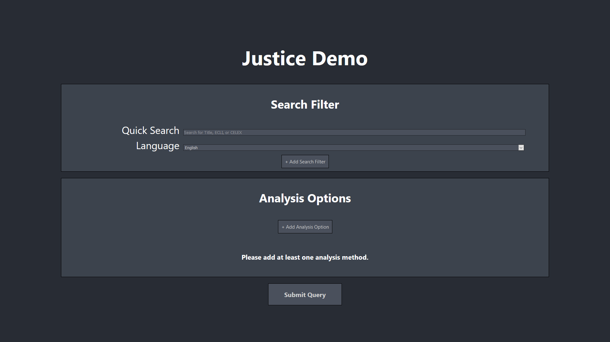

It features **two main views**: the **Search Filter** view and the **Analysis Options** view. A new query is submitted by clicking the *Submit Query* button.

## Search Filter view

By default the Search Filter view contains two inputs: *Quick Search* and *Language*. 

### Quick Search
*Quick Search* can be used to quickly search the database for *Document Titles*, European Case Law Identifier (*ECLI*) and *CELEX* number. The Web App will intelligently match the entered parameters, so separation or trailing typos do not influence the search. Leave the Quick Search empty if you do not wish to include any of these modifiers in your search.

#### Example Quick Search:
A user wants to quickly search for two documents they have bookmarked. They enter their CELEX numbers into the Quick Search:

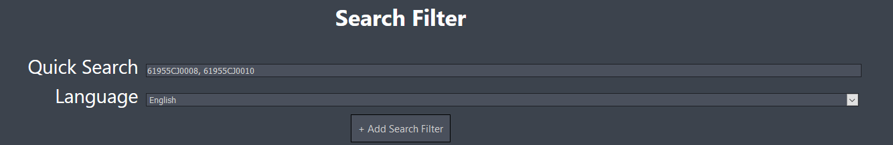

The Web App identifies the entered paramters as CELEX numbers and returns the matching documents from the database. In this case, the user separated the two parameters using a comma. The parameter matching function is able to handle many ways of input seperation, including typos. For example, the following query would match and return the same results as the previous one:

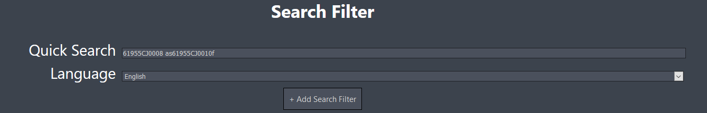


### Language

The *Language* dropdown allows the user to switch between matching English and German documents.

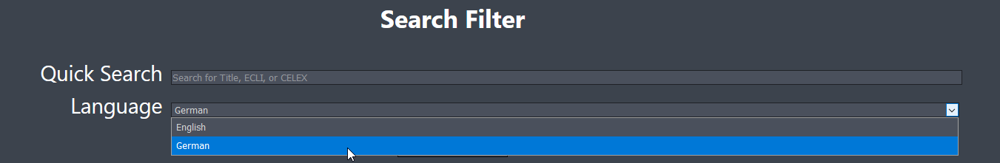

### Advanced Search Filters
By clicking the *+ Add Search Filter Button*, the user can open a menu that allows adding additional filters to the search.

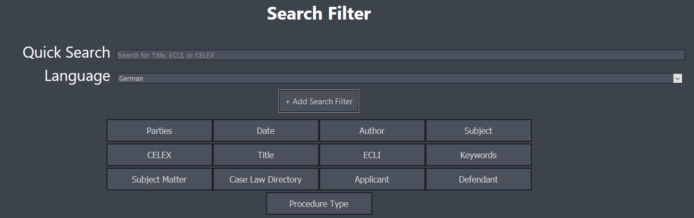

A new filter is added by clicking on its respective Button. In the following example, a new *Subject* filter was added:

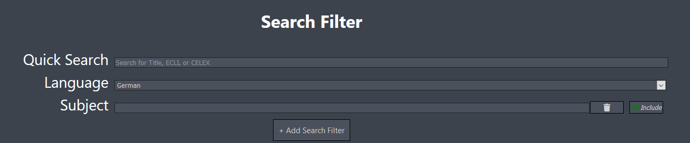

These advanced filters offer additional actions: they can be removed from the query by clicking the *trash can* icon, and they can be negated/excluded by clicking the *Include* toggle. Including a filter means all documents that match the filter will be returned, while excluding a filter means that all documents that do *not* match the filter will be returned.

## Analysis Options

By clicking on the *+ Add Analysis Option* button, the user can open a menu that allows adding different kinds of text analysis options to the query. Every query must contain at least one selected Analysis Option.

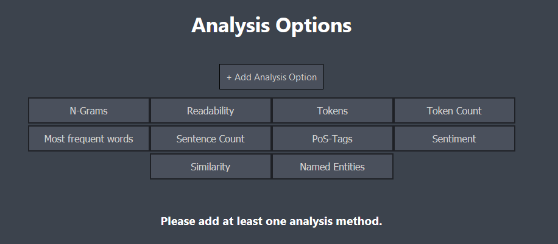

Some Analysis Options include customizable parameters that can be interacted with. For example, the "Token Count" option provides toggles for removing stop words and punctuation, as well as inclusion or exclusion of certain PoS tags.

For a full explanation of all available options see [here](https://github.com/phHartl/eu-judgement-analyse/tree/master#analysis-metrics-whole-corpus).

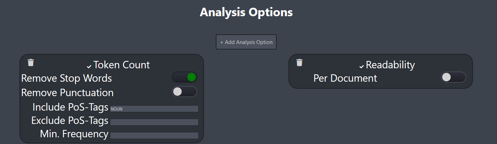


## Results

After a brief processing time (dependent on the size of the corpus and the chosen Analysis Options) the results will be shown at the bottom of the page. Some options allow the user to choose a visualization style, for example N-Grams can be viewed as either a wordcloud (recommended for a large set of data) or a bar chart. Below is an example of a bar chart illustration.

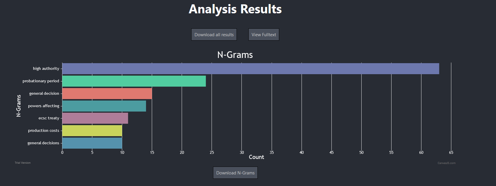

### "Per Document" Analysis
Some Analysis Options can be interpreted *per document*. This means, that if the user's query matches multiple documents, each document will be evaluated separetly. The user will then be able to view the results for each document by selecting its respective CELEX number via a dropdown menu in the results option. If the query matches multiple documents and *per document* analysis is **disabled**, the result will instead include the combined values (or in some cases, like *readability*, the average) of all documents.

In the example below, two documents were matched. The user can then choose which document's results to view via the dropdown menu. The screenshot also shows the *Wordcloud* visualization option. Hovering over entries shows additional information.

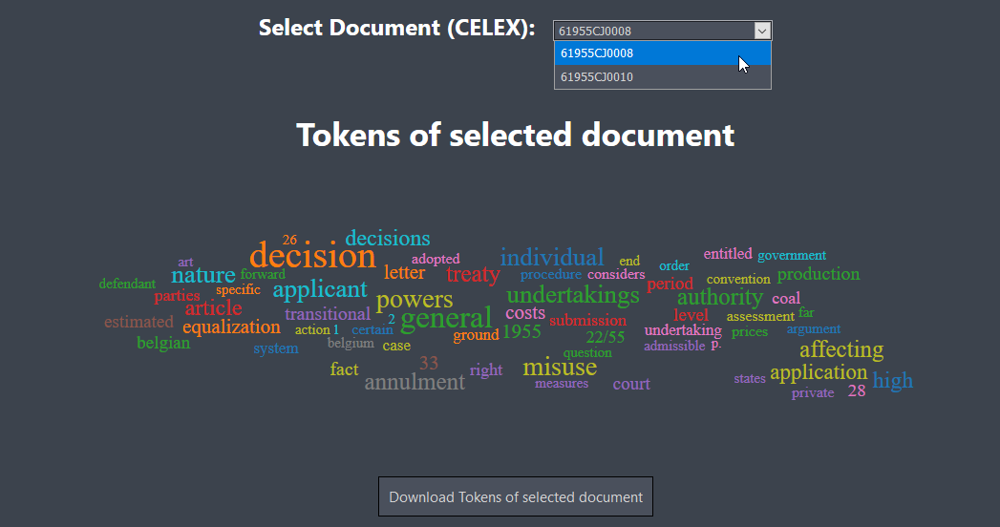

The user can also *Download* the entire result set by clicking the *Download all results* button, or download only a single analysis result by clicking its respective button (e.g. "Download N-Grams" button to download only the N-Grams result). The downloaded file will be a .json file that contains all retrieved information and can be used by the user to create their own data illustrations.

### Example .json download data
This downloaded data was queried over three documents, specified by CELEX numbers. Requested analysis options were *bigrams* (N-Grams with N = 2) and the 10 most used *Tokens* with removed stopwords and punctuation.

```
{
  celex_numbers: [
    "61955CJ0008",
    "61955CJ0010",
    "61957CJ0018"
  ],
  n-grams: [
    [
      "high authority",
      63
    ],
    [
      "probationary period",
      24
    ],
    [
      "general decision",
      15
    ],
    [
      "powers affecting",
      14
    ],
    [
      "ecsc treaty",
      11
    ],
    [
      "production costs",
      10
    ],
    [
      "general decisions",
      10
    ]
  ],
  tokens: [
    [
      "applicant",
      92
    ],
    [
      "authority",
      71
    ],
    [
      "decision",
      67
    ],
    [
      "court",
      63
    ],
    [
      "high",
      63
    ],
    [
      "decisions",
      56
    ],
    [
      "article",
      52
    ],
    [
      "period",
      42
    ],
    [
      "application",
      41
    ],
    [
      "general",
      40
    ]
  ]
}
```

### View Fulltext

Via the *View Fulltext* button, the user can view the document's contents on [EUR-Lex](https://eur-lex.europa.eu/). Should the query consist of multiple documents, this will link to the first returned document.

## Example Use Case

### Search Filter
In the following example, the user searched for all documents released between 01. Jan 2009 and 31. Dec 2009, that are *not* part of Case Law Directories 'F' and 'B' (IDs for 'Staff Cases' and 'European Community (EEC/EC) before the Lisbon Treaty, see [here](https://eur-lex.europa.eu/browse/directories/case-law.html) for info). The *not* option is toggled by the include/exclude button, and the search for IDs instead of full labels is toggled by the ID/Label switch.

### Analysis Options
For Analysis Options, the user chose *Token Count* with removed stop words and punctuation, and *N-Grams* with N = 2, removed stop words and filtered numbers, limited to the 10 most common occurences and visualized as a bar chart.

The entered information for the *Search Filters* and *Analysis Options* can be seen on the screenshot below.

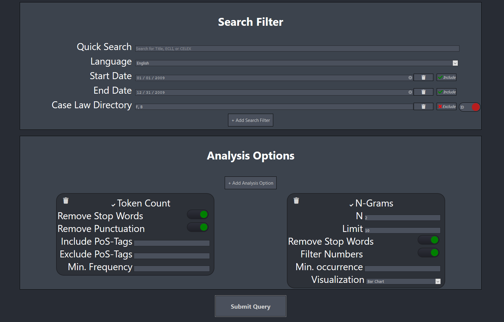

### Results

The results of the query can be seen below.

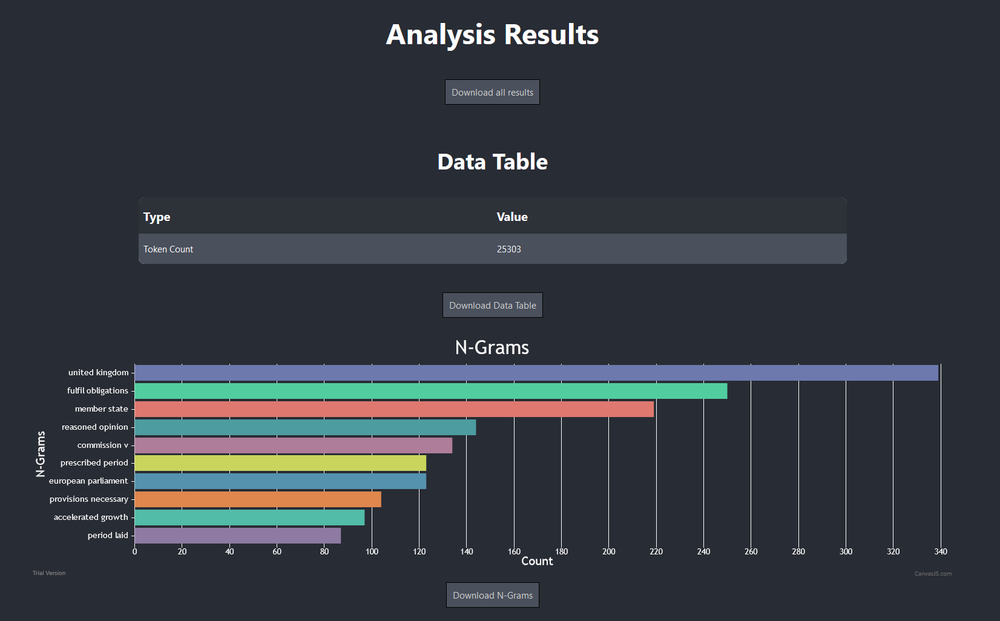


